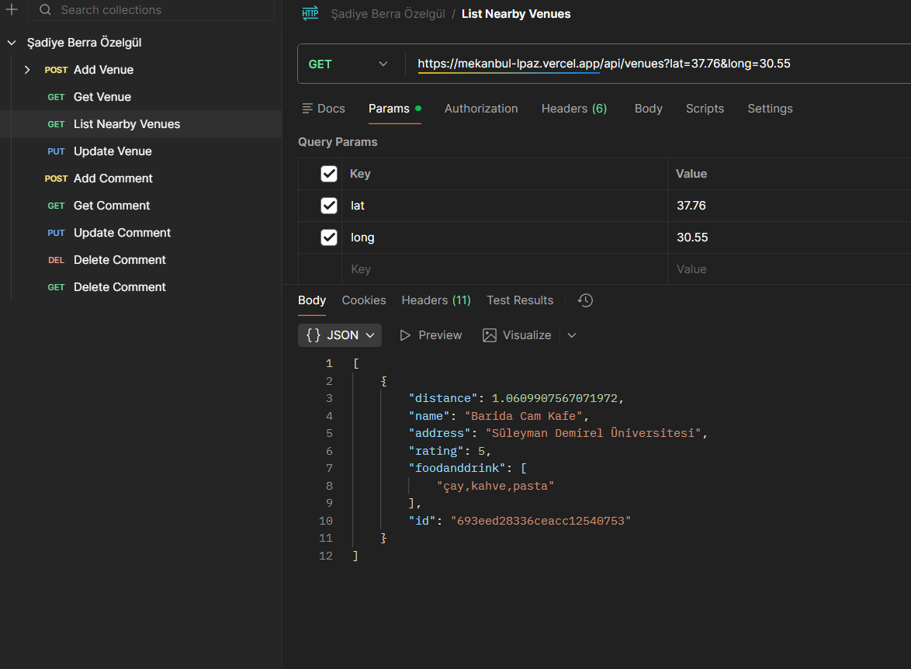
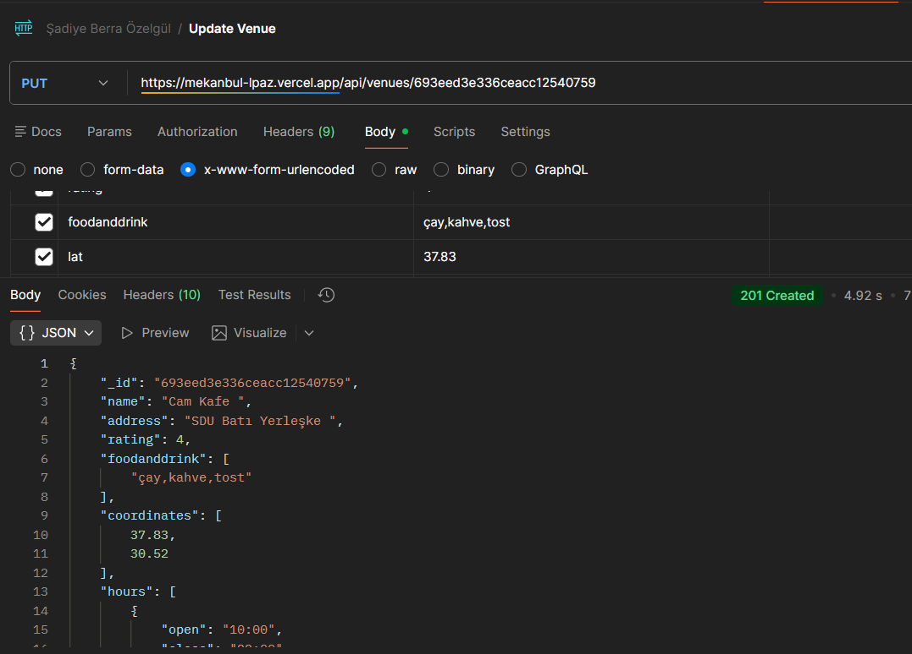
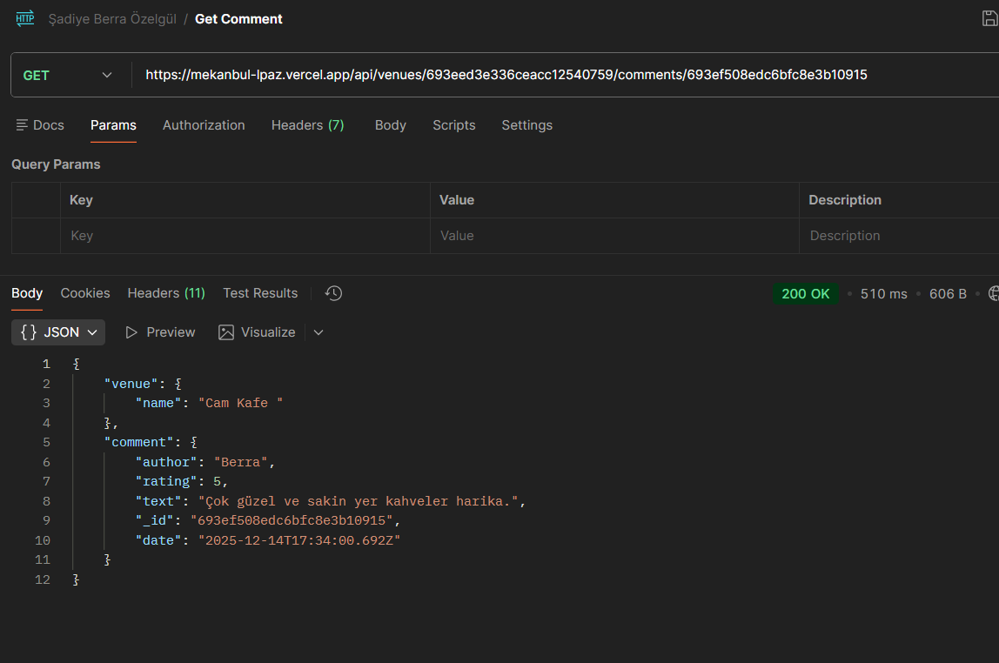
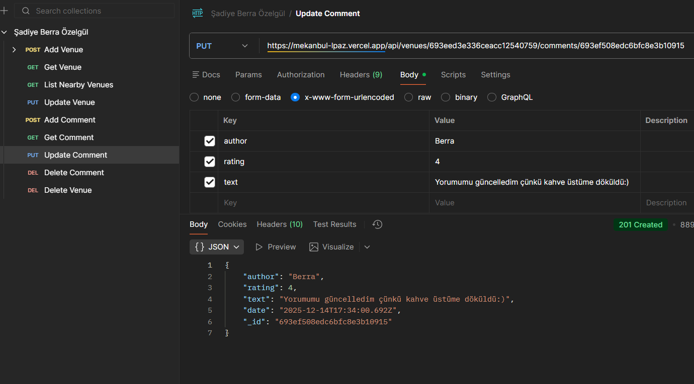
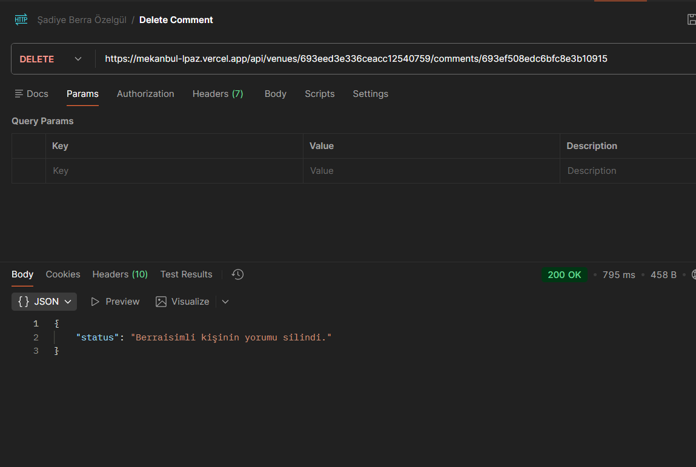

Vercel Linkim=> https://mekanbul-lpaz.vercel.app/

 Mekan (Venue) İşlemleri

GET /api/venues
➜ Tüm mekanları listeler

POST /api/venues
➜ Yeni bir mekan ekler

GET /api/venues/:venueid
➜ Belirtilen mekanın detaylarını getirir

PUT /api/venues/:venueid
➜ Belirtilen mekanı günceller

DELETE /api/venues/:venueid
➜ Belirtilen mekanı siler

 Yorum (Comment) İşlemleri

POST /api/venues/:venueid/comments
➜ Belirtilen mekana yeni yorum ekler

GET /api/venues/:venueid/comments/:commentid
➜ Belirtilen yorumu getirir

PUT /api/venues/:venueid/comments/:commentid
➜ Belirtilen yorumu günceller

Mekan(Venue) Tesleri  
Mekan Ekleme (POST /api/venues)

Mekanları Listeleme (GET /api/venues)

Mekan Detayı (GET /api/venues/:venueid)

Mekan Güncelleme (PUT /api/venues/:venueid)

Mekan Silme (DELETE /api/venues/:venueid)

Yorum(Comment) Testleri
Yorum Ekleme (POST /api/venues/:venueid/comments)

Yorum Getirme (GET /api/venues/:venueid/comments/:commentid)

Yorum Güncelleme (PUT /api/venues/:venueid/comments/:commentid)

### 🗑️ Yorum Silme (DELETE /api/venues/:venueid/comments/:commentid)

DELETE /api/venues/:venueid/comments/:commentid
➜ Belirtilen yorumu siler
